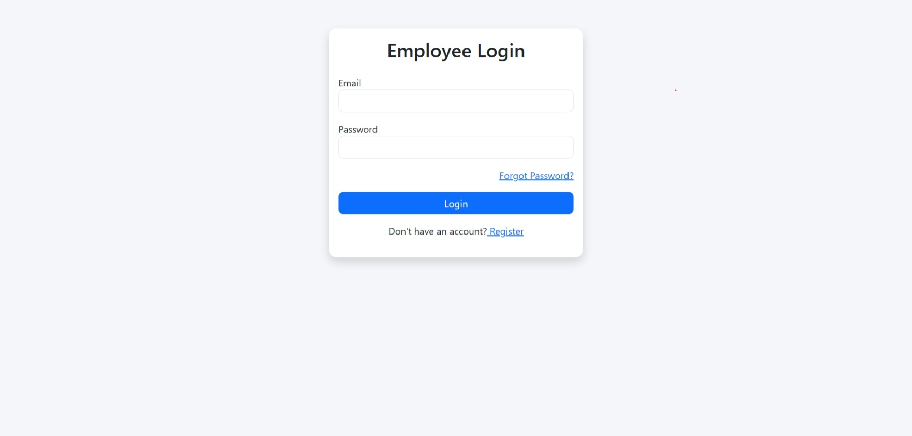
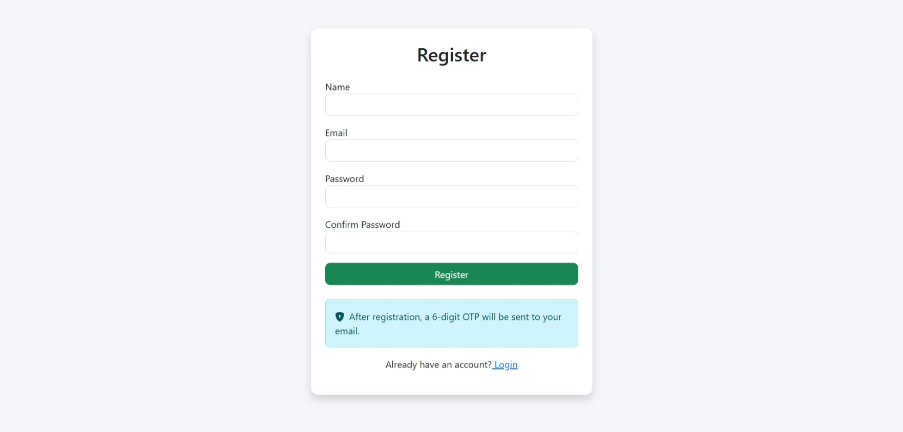
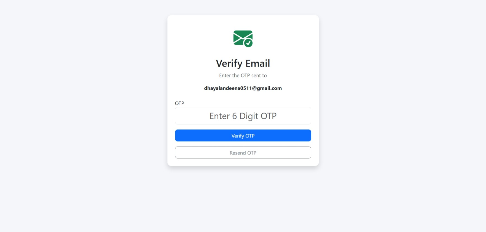
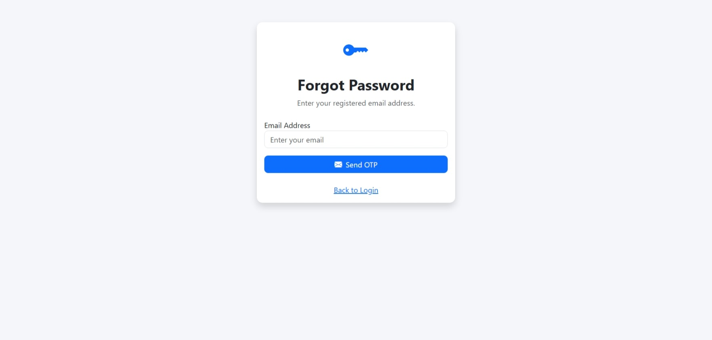
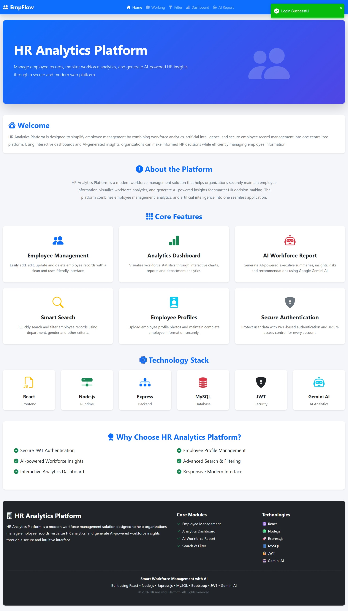
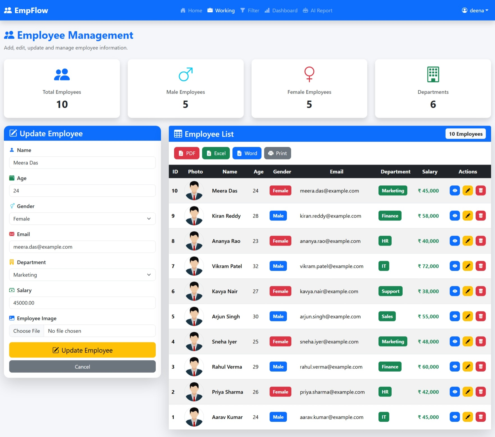
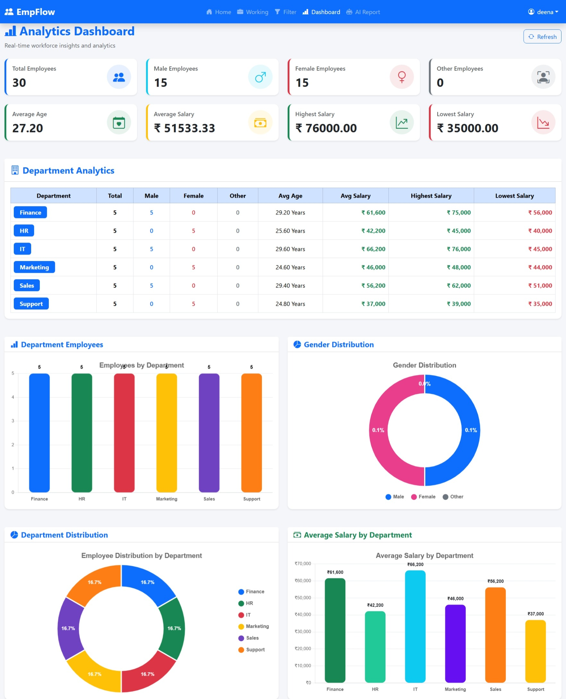
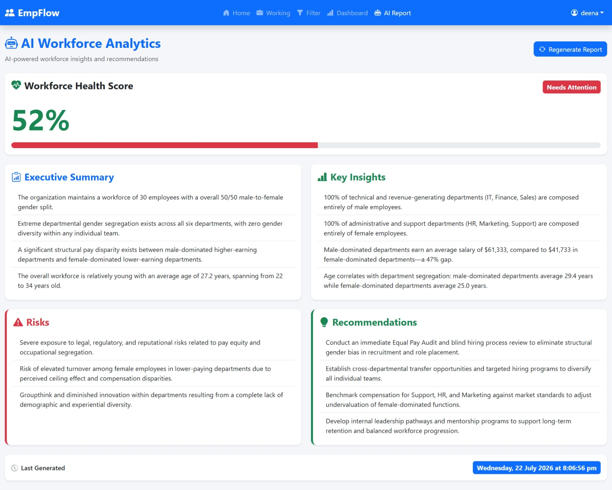
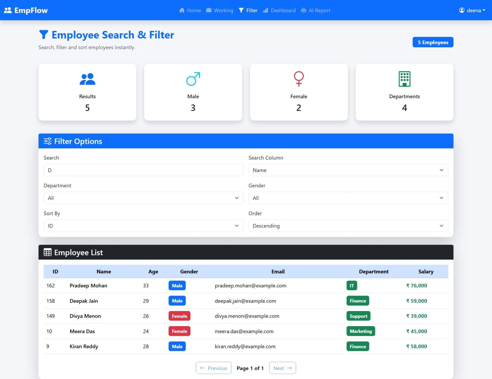

🚀 Employee Management System
A modern Full Stack Employee Management System built with the MERN ecosystem (React + Node.js + Express + MySQL). This application helps organizations manage employee records efficiently with secure authentication, AI-powered workforce analytics, dashboard insights, image uploads, email verification, and password recovery.

# 📸 Project Screenshots

| Login                            | Register                             |
| -------------------------------- | ------------------------------------ |
|  |  |

| Email Verification                      | Forgot Password                    |
| --------------------------------------- | ---------------------------------- |
|  |  |

| Home Dashboard                     | Add Employee                             |
| ---------------------------------- | ---------------------------------------- |
|      |  |

| Dashboard                                | AI Workforce Report               |
| ---------------------------------------- | --------------------------------- |
|  |  |

| Search & Filter                    |
| ---------------------------------  |
|  |

Login Page
Dashboard
Employee List
Employee Details
Add Employee
Analytics Dashboard
AI Report
✨ Features
🔐 Authentication
User Registration
Secure Login
JWT Authentication
Access Token
Refresh Token
Protected Routes
Logout
Password Hashing using bcrypt
📧 Email Features
Email Verification
Forgot Password
Reset Password
Secure Email otp Validation
👨‍💼 Employee Management
Add Employee
Update Employee
Delete Employee
View Employee Details
Upload Employee Profile Photo
Employee Profile Page
🔍 Advanced Search & Filter
Search by Name
Search by Email
Filter by Department
Filter by Gender
Sort Employees
Pagination
📊 Dashboard Analytics
Dashboard automatically calculates

Total Employees
Male Employees
Female Employees
Average Salary
Highest Salary
Lowest Salary
Average Age
Youngest Employee
Oldest Employee
Department Statistics
🤖 AI Workforce Analytics
Integrated with Google Gemini AI.

The AI generates:

Employee Health Score
Workforce Summary
Key Insights
Potential Risks
HR Recommendations
Department Analysis
📁 File Upload
Employee Profile Image Upload
Image Preview
Multer Storage
File Validation
Supported Formats
jpg
jpeg
png
webp
🛠 Tech Stack
Frontend
React.js
React Router
Axios
Bootstrap
React Icons
React Toastify
Chart.js
Backend
Node.js
Express.js
MySQL
JWT Authentication
bcrypt
Multer
Nodemailer
Cookie Parser
AI
Google Gemini API
Database
MySQL

Main Tables

users
employees
refresh_tokens
📂 Project Structure
Employee-Management-System

backend/
│
├── config/
├── controllers/
├── middleware/
├── models/
├── routes/
├── uploads/
├── utils/
├── app.js
└── package.json

frontend/
│
├── src/
│ ├── components/
│ ├── pages/
│ ├── services/
│ ├── assets/
│ └── App.jsx
│
└── package.json
⚙ Installation
Clone Repository
git clone https://github.com/yourusername/employee-management-system.git
cd employee-management-system
Backend Setup
cd backend
Install dependencies

npm install
Create .env

PORT=5000

DB_HOST=localhost
DB_USER=root
DB_PASSWORD=your_password
DB_NAME=employee_management

ACCESS_TOKEN_SECRET=your_secret

REFRESH_TOKEN_SECRET=your_secret

EMAIL_USER=your_email@gmail.com

EMAIL_PASS=your_app_password

GEMINI_API_KEY=your_gemini_api_key
Run backend

npm run dev
Frontend Setup
cd frontend
Install dependencies

npm install
Run frontend

npm run dev
📡 API Endpoints
Authentication
POST /api/auth/register

POST /api/auth/login

POST /api/auth/logout

POST /api/auth/refresh-token

POST /api/auth/forgot-password

POST /api/auth/reset-password

GET /api/auth/verify-email
Employee
GET /api/employees

GET /api/employees/:id

POST /api/employees

PUT /api/employees/:id

DELETE /api/employees/:id
Dashboard
GET /api/dashboard
AI Report
GET /api/ai/report
🔒 Security Features
Password Hashing
JWT Authentication
Refresh Token Rotation
Protected APIs
Email Verification
Secure Password Reset
Input Validation
File Type Validation
📊 Future Improvements
Attendance Management
Leave Management
Payroll System
Role Based Access Control
Employee Performance Tracking
Notifications
PDF Export
Excel Export
Audit Logs
Dark Mode
Mobile Responsive Dashboard
🧠 Learning Outcomes
This project helped me gain practical experience in

Full Stack Development
REST API Development
Authentication
Authorization
MySQL Database Design
AI Integration
Image Upload
Email Services
Dashboard Analytics
Secure Backend Development
React Component Architecture
👨‍💻 Author
R. Deenathayalan

M.Sc Computer Science

Full Stack Developer

⭐ If you like this project
Please give this repository a ⭐ on GitHub.

It motivates me to build more projects.
